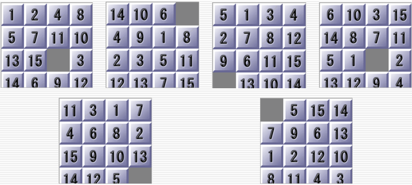
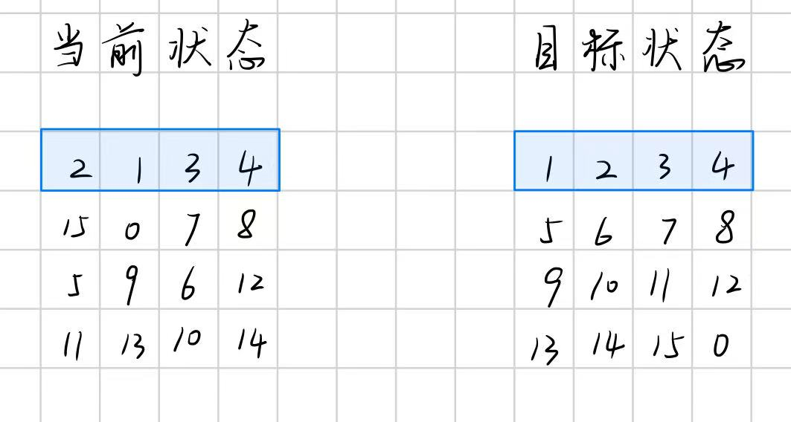

# 一、实验题目

尝试使用`A*` 与`IDA*` 算法解决15-Puzzle问题，启发式函数可以自己选取，最好多尝试几种不同的启发式函数




# 二、实验内容

## 1.算法原理

### 1.1 启发式函数

A* 算法和 IDA* 算法都属于启发式搜索算法。

不同于盲目搜索算法，启发式搜索算法引入了启发式函数h(n)，从而能够减少搜索的范围，降低问题求解的时间和空间复杂度。

引入启发式函数h(n)后，估价函数f(n)可表示为：
$$
f\left( n\right)=g\left( n\right)+h\left( n\right)
$$
其中，g(n)为从初始结点到当前结点n的路径长度，h(n)为从当前结点n到目标结点的最优路径的估计值。


#### **1.1.1启发式函数的性质**

启发式函数要满足两个性质：

**1.可采纳性**

当前结点n到目标结点的代价估计值h(n)，不大于真实代价h*(n)，

即
$$
h\left(n\right) \leq h^*\left(n\right)
$$
此时，算法必定能够找到最短路径

**2.单调性**
$$
h\left(n_1\right) \leq h\left(n_2\right)+cost(n_1,n_2)
$$


#### 1.1.2 15puzzle的启发式函数设计

对于15puzzle问题

常见有以下3种启发式函数：

##### **启发式函数1：不在目标位置上的数码块的个数和**

##### **启发式函数2：总曼哈顿距离**

曼哈顿距离的定义为：
$$
dist=\left| x-x_{target}\right|+\left| y-y_{target}\right|
$$
计算出每个不在目标位置上的数码块与目标位置的曼哈顿距离，然后求和得到总曼哈顿距离

##### **启发式函数3：总曼哈顿距离+线性冲突检测**

线性冲突的定义：

处于同一行或者同一列的两个数码，他们在目标状态中也是处于相同的这一行或者相同的这一列，导致他们要想到达目标状态，必须比曼哈顿距离至少多2步移动

下图是一个简单的例子：



关注第一行，在当前状态中数码 `1` 和 `2` 处于同一行，在目标状态中，他们也都处于同一行，而且正是现在的这行。这便是线性冲突

按照启发式函数2，数码 `1` 和 `2` 的曼哈顿距离之和为2，但是实际上只移动2步是肯定不能使数码 `1` 和 `2` 到达目标状态的。为了使数码 `1` 和 `2` 到达目标状态，必须至少多移动2步。


因此，该启发式函数的计算方法为：先按上面的启发式函数2计算出总曼哈顿距离，然后逐行、逐列检测是否有线性冲突，凡有1处，则对总距离+2。最终得到的总距离就是启发式函数的值。


### 1.2 A*算法原理

A*算法可以理解为是加入了启发信息的BFS

#### 1.2.1 数据结构

**结点类**

所含成员：

- 结点的状态：用二维数组或二维元组或一维元组来实现。实验发现：用一维元组的效率最高！
- 哈希值
- g(n)
- h(n)
- f(n)
- 父指针（父结点的哈希值）
- 空格位置（即：0的位置）

**OPEN表**

实现方式：优先队列

用于存放已经计算出代价函数 f(n) 的结点

按照代价函数 f(n) 从小到大的顺序排列，每次将代价函数 f(n) 最小的结点出队

**CLOSED表**

实现方式：集合set

用于存放已经扩展过的结点

避免重复扩展相同的结点，导致时间和空间的浪费


#### 1.2.2 算法流程

1. OPEN表和CLOSED表置空
2. 计算初始状态的h(n)、g(n)、f(n)等，构成初始结点，把初始结点放入OPEN表和CLOSED表
3. 取出OPEN表中f(n)值最小的结点。如果该结点的状态就是最终状态，则算法结束，找到解；否则，执行步骤4
4. 根据结点的状态生成新的状态，构成新结点
5. 如果新结点不在CLOSED表中，则将它加入OPEN表和CLOSED表
6. 重复步骤3、4、5，直至找到解


### 1.3 IDA*算法原理

IDA*算法可以理解为是加入了启发信息和深度限制的DFS

#### 1.3.1 数据结构

**结点状态**

用二维数组或二维元组或一维元组来实现。实验发现：用一维元组的效率最高！

**visited表**

实现方式：集合set

用于记录已经扩展过的结点状态

避免重复扩展相同的结点，导致时间和空间的浪费

**bound**

深度阈值


#### 1.3.2 算法流程

1. 把初始状态加入visited表，将初始状态的启发式函数值h(n)作为深度阈值bound

2. 按照DFS的思想，递归扩展子结点。

   递归过程：

   1. 如果当前结点的f(n) >bound，则返回当前结点的f(n)
   2. 如果当前结点的状态就是目标状态，则返回
   3. 如果上述二者都不满足，则继续递归扩展其子节点


## 2.关键代码展示

### 2.1 启发式函数

**启发式函数1：不在目标位置上的数码块的个数和**

```python
def cal_misplaced(self,state):
    # 不在最终位置上的数量
    num_misplaced=0
    for i in range(len(end_state)):
        if state[i]!=self.end_state[i]:
            num_misplaced+=1
    return num_misplaced
```


**启发式函数2：总曼哈顿距离**

```python
def cal_manhattan(self, state):
    # 曼哈顿距离
    dist = 0
    for idx in range(len(state)):
        if state[idx] == 0:
            continue
        target = self.target_pos[state[idx]]  # 获取目标位置
        curr_row, curr_col = idx // self.size[1], idx % self.size[1]  # 获取当前位置
        dist += abs(target[0] - curr_row) + abs(target[1] - curr_col)
    return dist
```


**启发式函数3：总曼哈顿距离+线性冲突检测**

线性冲突检测

```python
def cal_linear_conflict(self, state):
    """线性冲突优化"""
    # 线性冲突检测
    if state in self.linear_conflict_cache:
        return self.linear_conflict_cache[state]

    conflict = 0
    # 行冲突检测
    for row in range(4):
        tiles = [state[i] for i in range(row * 4, (row + 1) * 4) if state[i] != 0]
        for i in range(len(tiles)):
            for j in range(i + 1, len(tiles)):
                ti, tj = tiles[i], tiles[j]
                if (ti - 1) // 4 == row and (tj - 1) // 4 == row and ti > tj:
                    conflict += 2
    # 列冲突检测
    for col in range(4):
        tiles = [state[col + row * 4] for row in range(4) if state[col + row * 4] != 0]
        for i in range(len(tiles)):
            for j in range(i + 1, len(tiles)):
                ti, tj = tiles[i], tiles[j]
                if (ti - 1) % 4 == col and (tj - 1) % 4 == col and ti > tj:
                    conflict += 2
    self.linear_conflict_cache[state] = conflict

    return conflict
```


总曼哈顿距离+线性冲突检测

```python
self.cal_manhattan(state) + self.cal_linear_conflict(state)
```


### 2.2 A*算法关键代码

A*算法主函数

```python
def solve(self):
    if self.is_solvable(self.init_state)==False:
        # 无解
        print("无解!")
        return False

    # 初始化CLOSED表和OPEN表
    self.CLOSED = set()
    OPEN_heap = []

    # 根节点
    init_hn=self.cal_hn(self.init_state)
    init_hash_value=hash(self.init_state)
    init_zero_pos=self.find_zero(self.init_state)
    root_node=Node(self.init_state,init_hash_value,gn=0,hn=init_hn,parent=-1,zero_pos=init_zero_pos)

    heapq.heappush(OPEN_heap,root_node)
    self.CLOSED.add(root_node.hash_value)
    self.nodes[init_hash_value]=root_node

    while OPEN_heap:
        # 取出队列中最小的结点
        top=heapq.heappop(OPEN_heap)

        # 如果该节点就是最终状态，则找到解
        if top.state==self.end_state:
            return self.reconstruct_path(top)

        # 未找到解
        for new_state,new_zero in self.generate_moves(top):
            new_hash_value=hash(new_state)
            if new_hash_value in self.CLOSED:
                continue

            new_hn = self.cal_hn(new_state)
            new_node = Node(new_state, new_hash_value,
                            gn=top.gn + 1, hn=new_hn,
                            parent=top.hash_value,  # 记录父结点的hash值
                            zero_pos=new_zero)
            heapq.heappush(OPEN_heap, new_node)
            self.CLOSED.add(new_hash_value)
            self.nodes[new_hash_value] = new_node

    return []
```


### 2.3 IDA*算法关键代码

IDA*算法主函数

```python
def solve(self):
    if self.is_solvable(self.init_state) == False:
        # 无解
        print("无解!")
        return False

    self.visited={self.init_state}
    self.path = [self.init_state]
    self.bound=self.cal_hn(self.init_state)

    while True:
        result=self.IDAstar_search(gn=0)
        if result=="FOUND":
            return self.path
        elif result==float('inf'):
            print("无解!")
            return None

        # 更新
        self.bound=result
        self.visited = {self.init_state}
        self.path = [self.init_state]

```


递归搜索

```python
def IDAstar_search(self,gn):
    curr_state=self.path[-1]
    fn=gn+self.cal_hn(curr_state)
    if fn>self.bound:
        return fn
    if curr_state==self.end_state:
        return "FOUND"

    min_cost=float('inf')
    for new_state,new_zero_pos in self.generate_moves(curr_state):
        if new_state in self.visited:
            continue

        self.path.append(new_state)
        self.visited.add(new_state)

        result=self.IDAstar_search(gn + 1)
        if result=="FOUND":
            return "FOUND"
        elif result<min_cost:
            min_cost=result

        self.path.pop()
        self.visited.remove(new_state)
    return min_cost
```


### 2.4 判断是否有解

计算空格位置的行差与逆序数之和，

若和为偶数，则有解

否则，无解

```python
def is_solvable(self,initial_state):
    """
    判断 15 拼图初始状态是否可解。
    :param initial_state: 二维列表表示的初始状态。
    :return: True（可解）/False（不可解）。
    """
    zero_i, zero_j = self.find_zero(initial_state)
    target_zero_i = len(initial_state) - 1
    # 计算行差
    row_diff = target_zero_i - zero_i
    # 计算逆序数
    flat = []
    for num in initial_state:
        if num != 0:
            flat.append(num)

    inv_count = 0
    for i in range(len(flat)):
        for j in range(i + 1, len(flat)):
            if flat[i] > flat[j]:
                inv_count += 1

    return (inv_count + row_diff) % 2 == 0

```


## 3.创新点

### 3.1 启发式函数的创新点

使用 **总曼哈顿距离+线性冲突** 的启发式函数，对代价的估计更加准确，因而能够提高搜索速度。

线性冲突的具体原理，见上文启发式函数3的介绍

实际效果：

选用问题1、2、3进行测试

| A*算法                | 问题1(22步)的求解时间 | 问题2(49步)的求解时间 | 问题3(15步)的求解时间 |
| --------------------- | --------------------- | --------------------- | --------------------- |
| 总曼哈顿距离          | 0.001553s             | 18.314368s            | 0.420712s             |
| 总曼哈顿距离+线性冲突 | 0.003465s             | 10.794894s            | 0.102976s             |

| IDA*算法              | 问题1(22步)的求解时间 | 问题2(49步)的求解时间 | 问题3(15步)的求解时间 |
| --------------------- | --------------------- | --------------------- | --------------------- |
| 总曼哈顿距离          | 0.000646s             | 33.7401s              | 0.000138s             |
| 总曼哈顿距离+线性冲突 | 0.001741s             | 13.6257s              | 0.027080s             |

分析数据不难发现，对于求解步数较小的问题，在启发式函数中加入了线性冲突 不一定更快，

但是对于步数较大的问题，在启发式函数中加入了线性冲突能够明显加快求解速度


### 3.2 内存优化

在解决15puzzle问题中，最多有 `16！`种状态，每个状态有16维。

如果问题规模比较大，会使用大量的内存空间，使用较长时间来求解。

因此，在代码中想办法减少内存占用十分有必要。

#### 3.2.1 减少Node内存占用

使用`__slots__`减少Node内存占用

```python
__slots__ = ('state', 'hash_value', 'gn', 'hn', 'fn', 'parent', 'zero_pos')
```

>解释：
>
>默认情况下，Python 类的实例属性存储在动态字典，导致额外的内存开销
>
>通过以下__slots__，显式声明类的属性列表，使实例改用固定大小的数组存储属性
>
>优点：减少内存占用，提升访问速度


#### 3.2.2 **状态存储**

将状态转换为**元组**存储，提升哈希速度。

> 查阅资料发现：
>
> 在Python中，用元组来映射哈希值比使用列表来映射哈希值更加准确，而且速度更快

因此，我采用了二维元组的方式来存储状态


但是，在解决问题6时，遇到了**内存不足**的问题，如下所示

```bash
Traceback (most recent call last):
  File "D:\Python_code\作业\HW4\15-puzzle\puzzle_Astar_ds2.py", line 233, in <module>
    solution = solver.solve()
               ^^^^^^^^^^^^^^
  File "D:\Python_code\作业\HW4\15-puzzle\puzzle_Astar_ds2.py", line 163, in solve
    closed.add(new_hash)
MemoryError
```

解决方法：

使用**一维元组**来存储每个状态

>查阅资料发现：
>
>在Python中，一维元组比二维元组占用更少的存储空间


#### 3.2.3 **快速状态生成**

避免深拷贝，提升状态生成速度。

```python
# 不使用深拷贝，直接交换元素，减少拷贝的时间
new_state=list(state)
```


## 4.完整代码

### 4.1 A*算法完整代码

```python
import heapq
import time
from collections import deque

class Node:
    # 结点类

    # 内存优化
    # 默认情况下，Python 类的实例属性存储在动态字典，导致额外的内存开销
    # 通过以下__slots__，显式声明类的属性列表，使实例改用固定大小的数组存储属性
    # 优点：减少内存占用，提升访问速度
    __slots__ = ('state', 'hash_value', 'gn', 'hn', 'fn', 'parent', 'zero_pos')

    def __init__(self,state,hash_value,gn,hn,parent,zero_pos):
        self.state=state
        self.hash_value = hash_value  # 结点的标识
        self.gn=gn
        self.hn=hn
        self.fn=self.gn+self.hn
        self.parent=parent  # 父指针
        self.zero_pos=zero_pos # 0的位置

    def __lt__(self, other):  # 用于比较
        if self.fn==other.fn:
            return self.gn<other.gn
        return self.fn<other.fn

class A_star:
    def __init__(self,init_state,end_state,hn_mod=0):
        '''

        :param init_state: 初始状态
        :param end_state: 目标状态
        :param hn_mod:
        0:曼哈顿距离
        1:曼哈顿距离+线性冲突
        2:不在目标位置上的数量
        '''
        self.init_state=init_state
        self.end_state=end_state
        self.size=(4,4)
        self.hn_mod=hn_mod
        self.steps = []
        self.nodes = {}  # 存储结点编号与结点的映射

        self.target_pos = self.precompute_target_positions()  # 预计算目标位置
        self.linear_conflict_cache = {}  # 线性冲突缓存

    def precompute_target_positions(self):
        """预计算每个数字的目标坐标"""
        pos_dict={}
        for i in range(len(self.end_state)):
            num=self.end_state[i]
            if num!=0:
                pos_dict[num]=divmod(i,4)
        return pos_dict

    def find_zero(self,state):
        """获取0的位置"""
        return divmod(state.index(0), 4)

    def is_solvable(self,initial_state):
        """
        判断 15 拼图初始状态是否可解。
        :param initial_state: 二维列表表示的初始状态。
        :return: True（可解）/False（不可解）。
        """
        zero_i, zero_j = self.find_zero(initial_state)
        target_zero_i = len(initial_state) - 1
        # 计算行差
        row_diff = target_zero_i - zero_i
        # 计算逆序数
        flat = []
        for num in initial_state:
            if num != 0:
                flat.append(num)

        inv_count = 0
        for i in range(len(flat)):
            for j in range(i + 1, len(flat)):
                if flat[i] > flat[j]:
                    inv_count += 1

        return (inv_count + row_diff) % 2 == 0

    def generate_moves(self,node):
        '''生成移动后的状态'''
        moves=[]
        zero_row,zero_col=node.zero_pos
        state=node.state

        for d_row,d_col in [(0,1),(-1,0),(0,-1),(1,0)]:
            new_row=zero_row+d_row
            new_col=zero_col+d_col
            if 0<=new_row<=self.size[0]-1 and 0<=new_col<=self.size[1]-1:
                # 不使用深拷贝，直接交换元素，减少拷贝的时间
                new_state=list(state)
                zero_pos_1d=zero_row*self.size[0]+zero_col
                new_zero_pos_1d=new_row*self.size[0]+new_col
                new_state[new_zero_pos_1d],new_state[zero_pos_1d]=new_state[zero_pos_1d],new_state[new_zero_pos_1d]
                new_state=tuple(new_state) # 转换回元组
                moves.append((new_state,(new_row,new_col)))
        return moves

    '''--------------------启发函数--------------------'''
    def cal_misplaced(self,state):
        # 不在最终位置上的数量
        num_misplaced=0
        for i in range(self.size[0]):
            for j in range(self.size[1]):
                if state[i][j]!=self.end_state[i][j]:
                    num_misplaced+=1
        return num_misplaced

    def cal_manhattan(self,state):
        # 曼哈顿距离
        dist=0
        for idx in range(len(state)):
            if state[idx]==0:
                continue
            target = self.target_pos[state[idx]] # 获取目标位置
            curr_row, curr_col = idx // self.size[1], idx % self.size[1] # 获取当前位置
            dist += abs(target[0] - curr_row) + abs(target[1] - curr_col)
        return dist

    def cal_linear_conflict(self, state):
        """线性冲突优化"""
        # 线性冲突检测
        if state in self.linear_conflict_cache:
            return self.linear_conflict_cache[state]

        conflict = 0
        # 行冲突检测
        for row in range(4):
            tiles = [state[i] for i in range(row * 4, (row + 1) * 4) if state[i] != 0]
            for i in range(len(tiles)):
                for j in range(i + 1, len(tiles)):
                    ti, tj = tiles[i], tiles[j]
                    if (ti - 1) // 4 == row and (tj - 1) // 4 == row and ti > tj:
                        conflict += 2
        # 列冲突检测
        for col in range(4):
            tiles = [state[col + row * 4] for row in range(4) if state[col + row * 4] != 0]
            for i in range(len(tiles)):
                for j in range(i + 1, len(tiles)):
                    ti, tj = tiles[i], tiles[j]
                    if (ti - 1) % 4 == col and (tj - 1) % 4 == col and ti > tj:
                        conflict += 2
        self.linear_conflict_cache[state] = conflict

        return conflict

    def cal_hn(self,state):
        # 计算启发函数值h(n)
        if self.hn_mod==1:
            # 使用曼哈顿距离+线性冲突
            return self.cal_manhattan(state)+self.cal_linear_conflict(state)
        elif self.hn_mod==2:
            # 使用不在目标位置上的数量
            return self.cal_misplaced(state)
        else:
            # 默认使用曼哈顿距离
            return self.cal_manhattan(state)

    '''--------------------回溯最优路径--------------------'''
    def reconstruct_path(self, node):
        """回溯路径"""
        path = deque()
        while node.parent != -1:
            path.appendleft(node.state)
            node = self.nodes[node.parent]
        path.appendleft(self.init_state)
        return list(path)

    '''--------------------A*算法主函数--------------------'''
    def solve(self):
        if self.is_solvable(self.init_state)==False:
            # 无解
            print("无解!")
            return False

        # 初始化CLOSED表和OPEN表
        self.CLOSED = set()
        OPEN_heap = []

        # 根节点
        init_hn=self.cal_hn(self.init_state)
        init_hash_value=hash(self.init_state)
        init_zero_pos=self.find_zero(self.init_state)
        root_node=Node(self.init_state,init_hash_value,gn=0,hn=init_hn,parent=-1,zero_pos=init_zero_pos)

        heapq.heappush(OPEN_heap,root_node)
        self.CLOSED.add(root_node.hash_value)
        self.nodes[init_hash_value]=root_node

        while OPEN_heap:
            # 取出队列中最小的结点
            top=heapq.heappop(OPEN_heap)

            # 如果该节点就是最终状态，则找到解
            if top.state==self.end_state:
                return self.reconstruct_path(top)

            # 未找到解
            for new_state,new_zero in self.generate_moves(top):
                new_hash_value=hash(new_state)
                if new_hash_value in self.CLOSED:
                    continue

                new_hn = self.cal_hn(new_state)
                new_node = Node(new_state, new_hash_value,
                                gn=top.gn + 1, hn=new_hn,
                                parent=top.hash_value,  # 记录父结点的hash值
                                zero_pos=new_zero)
                heapq.heappush(OPEN_heap, new_node)
                self.CLOSED.add(new_hash_value)
                self.nodes[new_hash_value] = new_node

        return []


if __name__=="__main__":
    end_state=(1,2,3,4,
               5,6,7,8,
               9,10,11,12,
               13,14,15,0)
    init_state_dict=\
        {
         '1':(1,2,4,8,
              5,7,11,10,
              13,15,0,3,
              14,6,9,12),
         '2':(14,10,6,0,
              4,9,1,8,
              2,3,5,11,
              12,13,7,15),
         '3':(5,1,3,4,
              2,7,8,12,
              9,6,11,15,
              0,13,10,14),
         '4':(6,10,3,15,
              14,8,7,11,
              5,1,0,2,
              13,12,9,4),
         '5':(11,3,1,7,
              4,6,8,2,
              15,9,10,13,
              14,12,5,0),
         '6':(0,5,15,14,
              7,9,6,13,
              1,2,12,10,
              8,11,4,3)
        }
    for i in init_state_dict:
        init_state=init_state_dict[i]
        print(f"Problem {i}")
        start_time=time.perf_counter()

        solver=A_star(init_state=init_state,end_state=end_state,
                      hn_mod=1)

        solution=solver.solve()

        end_time=time.perf_counter()

        step_num=0
        for solutioin_step in solution:
            if step_num==0:
                print("initial state:")
            else:
                print(f"Step {step_num}")

            # 格式化输出
            for i in range(len(solutioin_step)):
                print(f"{solutioin_step[i]:-3d}",end="")
                if i%4==3:
                    print()
            step_num+=1
            print()
        print(f"总步骤数：{step_num-1}")
        print(f"用时：{end_time - start_time:3f}s\n")
```


### 4.2 IDA*算法完整代码

```python
import time

class IDA_star:
    def __init__(self,init_state,end_state,hn_mod=0):
        '''

        :param init_state: 初始状态 (1维元组)
        :param end_state: 目标状态 (1维元组)
        :param hn_mod:
        0:曼哈顿距离
        1:曼哈顿距离+线性冲突
        2:不在目标位置上的数量
        '''
        self.init_state=init_state
        self.end_state=end_state
        self.size=(4,4)
        self.hn_mod=hn_mod

        # 移动方向
        self.directions = [(-1, 0), (1, 0), (0, -1), (0, 1)]  # 上,下,左,右

        self.target_pos = self.precompute_target_positions()  # 预计算目标位置
        self.linear_conflict_cache = {}  # 线性冲突缓存

    def precompute_target_positions(self):
        """预计算每个数字的目标坐标"""
        pos_dict = {}
        for i in range(len(self.end_state)):
            num = self.end_state[i]
            if num != 0:
                pos_dict[num] = divmod(i, 4)
        return pos_dict

    def find_zero(self,state):
        """获取0的位置"""
        return divmod(state.index(0),4)

    def is_solvable(self,initial_state):
        """
        判断 15 拼图初始状态是否可解。
        :param initial_state: 二维列表表示的初始状态。
        :return: True（可解）/False（不可解）。
        """
        zero_i, zero_j = self.find_zero(initial_state)
        target_zero_i = len(initial_state) - 1
        # 计算行差
        row_diff = target_zero_i - zero_i
        # 计算逆序数
        flat = []
        for num in initial_state:
            if num != 0:
                flat.append(num)

        inv_count = 0
        for i in range(len(flat)):
            for j in range(i + 1, len(flat)):
                if flat[i] > flat[j]:
                    inv_count += 1

        return (inv_count + row_diff) % 2 == 0

    def generate_moves(self,state):
        """生成新状态"""
        moves=[]
        zero_row,zero_col=self.find_zero(state)

        for d_row,d_col in self.directions:
            new_row=zero_row+d_row
            new_col=zero_col+d_col
            if 0<=new_row<=self.size[0]-1 and 0<=new_col<=self.size[1]-1:
                # 不使用深拷贝，直接交换元素，减少拷贝的时间
                new_state=list(state)
                zero_pos_1d=zero_row*self.size[0]+zero_col
                new_zero_pos_1d=new_row*self.size[0]+new_col
                new_state[new_zero_pos_1d],new_state[zero_pos_1d]=new_state[zero_pos_1d],new_state[new_zero_pos_1d]
                
                new_state=tuple(new_state) # 转换回元组
                moves.append((new_state,(new_row,new_col)))
        return moves

    '''--------------------启发函数--------------------'''
    def cal_misplaced(self,state):
        # 不在最终位置上的数量
        num_misplaced=0
        for i in range(len(end_state)):
            if state[i]!=self.end_state[i]:
                num_misplaced+=1
        return num_misplaced

    def cal_manhattan(self, state):
        # 曼哈顿距离
        dist = 0
        for idx in range(len(state)):
            if state[idx] == 0:
                continue
            target = self.target_pos[state[idx]]  # 获取目标位置
            curr_row, curr_col = idx // self.size[1], idx % self.size[1]  # 获取当前位置
            dist += abs(target[0] - curr_row) + abs(target[1] - curr_col)
        return dist

    def cal_linear_conflict(self, state):
        """线性冲突优化"""
        # 线性冲突检测
        if state in self.linear_conflict_cache:
            return self.linear_conflict_cache[state]

        conflict = 0
        # 行冲突检测
        for row in range(4):
            tiles = [state[i] for i in range(row * 4, (row + 1) * 4) if state[i] != 0]
            for i in range(len(tiles)):
                for j in range(i + 1, len(tiles)):
                    ti, tj = tiles[i], tiles[j]
                    if (ti - 1) // 4 == row and (tj - 1) // 4 == row and ti > tj:
                        conflict += 2
        # 列冲突检测
        for col in range(4):
            tiles = [state[col + row * 4] for row in range(4) if state[col + row * 4] != 0]
            for i in range(len(tiles)):
                for j in range(i + 1, len(tiles)):
                    ti, tj = tiles[i], tiles[j]
                    if (ti - 1) % 4 == col and (tj - 1) % 4 == col and ti > tj:
                        conflict += 2
        self.linear_conflict_cache[state] = conflict

        return conflict

    def cal_hn(self, state):
        # 计算启发函数值h(n)
        if self.hn_mod == 1:
            # 使用曼哈顿距离+线性冲突
            return self.cal_manhattan(state) + self.cal_linear_conflict(state)
        elif self.hn_mod == 2:
            # 使用不在目标位置上的数量
            return self.cal_misplaced(state)
        else:
            # 默认使用曼哈顿距离
            return self.cal_manhattan(state)

    '''--------------------递归搜索--------------------'''
    def IDAstar_search(self,gn):
        curr_state=self.path[-1]
        fn=gn+self.cal_hn(curr_state)
        if fn>self.bound:
            return fn
        if curr_state==self.end_state:
            return "FOUND"

        min_cost=float('inf')
        for new_state,new_zero_pos in self.generate_moves(curr_state):
            if new_state in self.visited:
                continue
                
            self.path.append(new_state)
            self.visited.add(new_state)

            result=self.IDAstar_search(gn + 1)
            if result=="FOUND":
                return "FOUND"
            elif result<min_cost:
                min_cost=result

            self.path.pop()
            self.visited.remove(new_state)
        return min_cost

    '''--------------------IDA*算法主函数--------------------'''
    def solve(self):
        if self.is_solvable(self.init_state) == False:
            # 无解
            print("无解!")
            return False

        self.visited={self.init_state}
        self.path = [self.init_state]
        self.bound=self.cal_hn(self.init_state)

        while True:
            result=self.IDAstar_search(gn=0)
            if result=="FOUND":
                return self.path
            elif result==float('inf'):
                print("无解!")
                return None

            # 更新
            self.bound=result
            self.visited = {self.init_state}
            self.path = [self.init_state]


if __name__=="__main__":
    end_state=(1,2,3,4,
               5,6,7,8,
               9,10,11,12,
               13,14,15,0)
    init_state_dict=\
        {
         '1':(1,2,4,8,
              5,7,11,10,
              13,15,0,3,
              14,6,9,12),
         '2':(14,10,6,0,
              4,9,1,8,
              2,3,5,11,
              12,13,7,15),
         '3':(5,1,3,4,
              2,7,8,12,
              9,6,11,15,
              0,13,10,14),
         '4':(6,10,3,15,
              14,8,7,11,
              5,1,0,2,
              13,12,9,4),
         '5':(11,3,1,7,
              4,6,8,2,
              15,9,10,13,
              14,12,5,0),
         '6':(0,5,15,14,
              7,9,6,13,
              1,2,12,10,
              8,11,4,3)
        }
    for i in init_state_dict:
        init_state=init_state_dict[i]
        print(f"Problem {i}")
        start_time=time.perf_counter()

        solver=IDA_star(init_state=init_state,end_state=end_state,
                      hn_mod=1)

        solution=solver.solve()

        end_time=time.perf_counter()

        step_num=0
        for solutioin_step in solution:
            if step_num==0:
                print("initial state:")
            else:
                print(f"Step {step_num}")

            # 格式化输出
            for i in range(len(solutioin_step)):
                print(f"{solutioin_step[i]:-3d}",end="")
                if i%4==3:
                    print()
            step_num+=1
            print()
        print(f"总步骤数：{step_num-1}")
        print(f"用时：{end_time - start_time:3f}s\n")
```


# 三、实验结果及分析

## A*算法

### 实验结果

以下结果是使用 **总曼哈顿距离+线性冲突** 的启发式函数得到的

#### Problem 1

```bash
Problem 1
initial state:
(1, 2, 4, 8)
(5, 7, 11, 10)
(13, 15, 0, 3)
(14, 6, 9, 12)

Step 1
(1, 2, 4, 8)
(5, 7, 11, 10)
(13, 15, 3, 0)
(14, 6, 9, 12)

Step 2
(1, 2, 4, 8)
(5, 7, 11, 0)
(13, 15, 3, 10)
(14, 6, 9, 12)

Step 3
(1, 2, 4, 8)
(5, 7, 0, 11)
(13, 15, 3, 10)
(14, 6, 9, 12)

Step 4
(1, 2, 4, 8)
(5, 7, 3, 11)
(13, 15, 0, 10)
(14, 6, 9, 12)

Step 5
(1, 2, 4, 8)
(5, 7, 3, 11)
(13, 0, 15, 10)
(14, 6, 9, 12)

Step 6
(1, 2, 4, 8)
(5, 7, 3, 11)
(13, 6, 15, 10)
(14, 0, 9, 12)

Step 7
(1, 2, 4, 8)
(5, 7, 3, 11)
(13, 6, 15, 10)
(14, 9, 0, 12)

Step 8
(1, 2, 4, 8)
(5, 7, 3, 11)
(13, 6, 0, 10)
(14, 9, 15, 12)

Step 9
(1, 2, 4, 8)
(5, 7, 3, 11)
(13, 6, 10, 0)
(14, 9, 15, 12)

Step 10
(1, 2, 4, 8)
(5, 7, 3, 0)
(13, 6, 10, 11)
(14, 9, 15, 12)

Step 11
(1, 2, 4, 0)
(5, 7, 3, 8)
(13, 6, 10, 11)
(14, 9, 15, 12)

Step 12
(1, 2, 0, 4)
(5, 7, 3, 8)
(13, 6, 10, 11)
(14, 9, 15, 12)

Step 13
(1, 2, 3, 4)
(5, 7, 0, 8)
(13, 6, 10, 11)
(14, 9, 15, 12)

Step 14
(1, 2, 3, 4)
(5, 0, 7, 8)
(13, 6, 10, 11)
(14, 9, 15, 12)

Step 15
(1, 2, 3, 4)
(5, 6, 7, 8)
(13, 0, 10, 11)
(14, 9, 15, 12)

Step 16
(1, 2, 3, 4)
(5, 6, 7, 8)
(13, 9, 10, 11)
(14, 0, 15, 12)

Step 17
(1, 2, 3, 4)
(5, 6, 7, 8)
(13, 9, 10, 11)
(0, 14, 15, 12)

Step 18
(1, 2, 3, 4)
(5, 6, 7, 8)
(0, 9, 10, 11)
(13, 14, 15, 12)

Step 19
(1, 2, 3, 4)
(5, 6, 7, 8)
(9, 0, 10, 11)
(13, 14, 15, 12)

Step 20
(1, 2, 3, 4)
(5, 6, 7, 8)
(9, 10, 0, 11)
(13, 14, 15, 12)

Step 21
(1, 2, 3, 4)
(5, 6, 7, 8)
(9, 10, 11, 0)
(13, 14, 15, 12)

Step 22
(1, 2, 3, 4)
(5, 6, 7, 8)
(9, 10, 11, 12)
(13, 14, 15, 0)

总步骤数：22
用时：0.003449s

```

#### Problem 2

```bash
Problem 2
initial state:
(14, 10, 6, 0)
(4, 9, 1, 8)
(2, 3, 5, 11)
(12, 13, 7, 15)

Step 1
(14, 10, 0, 6)
(4, 9, 1, 8)
(2, 3, 5, 11)
(12, 13, 7, 15)

Step 2
(14, 0, 10, 6)
(4, 9, 1, 8)
(2, 3, 5, 11)
(12, 13, 7, 15)

Step 3
(14, 9, 10, 6)
(4, 0, 1, 8)
(2, 3, 5, 11)
(12, 13, 7, 15)

Step 4
(14, 9, 10, 6)
(0, 4, 1, 8)
(2, 3, 5, 11)
(12, 13, 7, 15)

Step 5
(0, 9, 10, 6)
(14, 4, 1, 8)
(2, 3, 5, 11)
(12, 13, 7, 15)

Step 6
(9, 0, 10, 6)
(14, 4, 1, 8)
(2, 3, 5, 11)
(12, 13, 7, 15)

Step 7
(9, 4, 10, 6)
(14, 0, 1, 8)
(2, 3, 5, 11)
(12, 13, 7, 15)

Step 8
(9, 4, 10, 6)
(14, 1, 0, 8)
(2, 3, 5, 11)
(12, 13, 7, 15)

Step 9
(9, 4, 0, 6)
(14, 1, 10, 8)
(2, 3, 5, 11)
(12, 13, 7, 15)

Step 10
(9, 0, 4, 6)
(14, 1, 10, 8)
(2, 3, 5, 11)
(12, 13, 7, 15)

Step 11
(9, 1, 4, 6)
(14, 0, 10, 8)
(2, 3, 5, 11)
(12, 13, 7, 15)

Step 12
(9, 1, 4, 6)
(14, 3, 10, 8)
(2, 0, 5, 11)
(12, 13, 7, 15)

Step 13
(9, 1, 4, 6)
(14, 3, 10, 8)
(0, 2, 5, 11)
(12, 13, 7, 15)

Step 14
(9, 1, 4, 6)
(0, 3, 10, 8)
(14, 2, 5, 11)
(12, 13, 7, 15)

Step 15
(0, 1, 4, 6)
(9, 3, 10, 8)
(14, 2, 5, 11)
(12, 13, 7, 15)

Step 16
(1, 0, 4, 6)
(9, 3, 10, 8)
(14, 2, 5, 11)
(12, 13, 7, 15)

Step 17
(1, 3, 4, 6)
(9, 0, 10, 8)
(14, 2, 5, 11)
(12, 13, 7, 15)

Step 18
(1, 3, 4, 6)
(9, 2, 10, 8)
(14, 0, 5, 11)
(12, 13, 7, 15)

Step 19
(1, 3, 4, 6)
(9, 2, 10, 8)
(14, 13, 5, 11)
(12, 0, 7, 15)

Step 20
(1, 3, 4, 6)
(9, 2, 10, 8)
(14, 13, 5, 11)
(0, 12, 7, 15)

Step 21
(1, 3, 4, 6)
(9, 2, 10, 8)
(0, 13, 5, 11)
(14, 12, 7, 15)

Step 22
(1, 3, 4, 6)
(9, 2, 10, 8)
(13, 0, 5, 11)
(14, 12, 7, 15)

Step 23
(1, 3, 4, 6)
(9, 2, 10, 8)
(13, 5, 0, 11)
(14, 12, 7, 15)

Step 24
(1, 3, 4, 6)
(9, 2, 10, 8)
(13, 5, 11, 0)
(14, 12, 7, 15)

Step 25
(1, 3, 4, 6)
(9, 2, 10, 0)
(13, 5, 11, 8)
(14, 12, 7, 15)

Step 26
(1, 3, 4, 0)
(9, 2, 10, 6)
(13, 5, 11, 8)
(14, 12, 7, 15)

Step 27
(1, 3, 0, 4)
(9, 2, 10, 6)
(13, 5, 11, 8)
(14, 12, 7, 15)

Step 28
(1, 0, 3, 4)
(9, 2, 10, 6)
(13, 5, 11, 8)
(14, 12, 7, 15)

Step 29
(1, 2, 3, 4)
(9, 0, 10, 6)
(13, 5, 11, 8)
(14, 12, 7, 15)

Step 30
(1, 2, 3, 4)
(9, 5, 10, 6)
(13, 0, 11, 8)
(14, 12, 7, 15)

Step 31
(1, 2, 3, 4)
(9, 5, 10, 6)
(13, 12, 11, 8)
(14, 0, 7, 15)

Step 32
(1, 2, 3, 4)
(9, 5, 10, 6)
(13, 12, 11, 8)
(14, 7, 0, 15)

Step 33
(1, 2, 3, 4)
(9, 5, 10, 6)
(13, 12, 0, 8)
(14, 7, 11, 15)

Step 34
(1, 2, 3, 4)
(9, 5, 10, 6)
(13, 0, 12, 8)
(14, 7, 11, 15)

Step 35
(1, 2, 3, 4)
(9, 5, 10, 6)
(13, 7, 12, 8)
(14, 0, 11, 15)

Step 36
(1, 2, 3, 4)
(9, 5, 10, 6)
(13, 7, 12, 8)
(0, 14, 11, 15)

Step 37
(1, 2, 3, 4)
(9, 5, 10, 6)
(0, 7, 12, 8)
(13, 14, 11, 15)

Step 38
(1, 2, 3, 4)
(0, 5, 10, 6)
(9, 7, 12, 8)
(13, 14, 11, 15)

Step 39
(1, 2, 3, 4)
(5, 0, 10, 6)
(9, 7, 12, 8)
(13, 14, 11, 15)

Step 40
(1, 2, 3, 4)
(5, 10, 0, 6)
(9, 7, 12, 8)
(13, 14, 11, 15)

Step 41
(1, 2, 3, 4)
(5, 10, 6, 0)
(9, 7, 12, 8)
(13, 14, 11, 15)

Step 42
(1, 2, 3, 4)
(5, 10, 6, 8)
(9, 7, 12, 0)
(13, 14, 11, 15)

Step 43
(1, 2, 3, 4)
(5, 10, 6, 8)
(9, 7, 0, 12)
(13, 14, 11, 15)

Step 44
(1, 2, 3, 4)
(5, 10, 6, 8)
(9, 0, 7, 12)
(13, 14, 11, 15)

Step 45
(1, 2, 3, 4)
(5, 0, 6, 8)
(9, 10, 7, 12)
(13, 14, 11, 15)

Step 46
(1, 2, 3, 4)
(5, 6, 0, 8)
(9, 10, 7, 12)
(13, 14, 11, 15)

Step 47
(1, 2, 3, 4)
(5, 6, 7, 8)
(9, 10, 0, 12)
(13, 14, 11, 15)

Step 48
(1, 2, 3, 4)
(5, 6, 7, 8)
(9, 10, 11, 12)
(13, 14, 0, 15)

Step 49
(1, 2, 3, 4)
(5, 6, 7, 8)
(9, 10, 11, 12)
(13, 14, 15, 0)

总步骤数：49
用时：10.658609s
```

#### Problem 3

```bash
Problem 3
initial state:
(5, 1, 3, 4)
(2, 7, 8, 12)
(9, 6, 11, 15)
(0, 13, 10, 14)

Step 1
(5, 1, 3, 4)
(2, 7, 8, 12)
(9, 6, 11, 15)
(13, 0, 10, 14)

Step 2
(5, 1, 3, 4)
(2, 7, 8, 12)
(9, 6, 11, 15)
(13, 10, 0, 14)

Step 3
(5, 1, 3, 4)
(2, 7, 8, 12)
(9, 6, 11, 15)
(13, 10, 14, 0)

Step 4
(5, 1, 3, 4)
(2, 7, 8, 12)
(9, 6, 11, 0)
(13, 10, 14, 15)

Step 5
(5, 1, 3, 4)
(2, 7, 8, 0)
(9, 6, 11, 12)
(13, 10, 14, 15)

Step 6
(5, 1, 3, 4)
(2, 7, 0, 8)
(9, 6, 11, 12)
(13, 10, 14, 15)

Step 7
(5, 1, 3, 4)
(2, 0, 7, 8)
(9, 6, 11, 12)
(13, 10, 14, 15)

Step 8
(5, 1, 3, 4)
(0, 2, 7, 8)
(9, 6, 11, 12)
(13, 10, 14, 15)

Step 9
(0, 1, 3, 4)
(5, 2, 7, 8)
(9, 6, 11, 12)
(13, 10, 14, 15)

Step 10
(1, 0, 3, 4)
(5, 2, 7, 8)
(9, 6, 11, 12)
(13, 10, 14, 15)

Step 11
(1, 2, 3, 4)
(5, 0, 7, 8)
(9, 6, 11, 12)
(13, 10, 14, 15)

Step 12
(1, 2, 3, 4)
(5, 6, 7, 8)
(9, 0, 11, 12)
(13, 10, 14, 15)

Step 13
(1, 2, 3, 4)
(5, 6, 7, 8)
(9, 10, 11, 12)
(13, 0, 14, 15)

Step 14
(1, 2, 3, 4)
(5, 6, 7, 8)
(9, 10, 11, 12)
(13, 14, 0, 15)

Step 15
(1, 2, 3, 4)
(5, 6, 7, 8)
(9, 10, 11, 12)
(13, 14, 15, 0)

总步骤数：15
用时：0.097421s

```

#### Problem 4

```bash
Problem 4
initial state:
(6, 10, 3, 15)
(14, 8, 7, 11)
(5, 1, 0, 2)
(13, 12, 9, 4)

Step 1
(6, 10, 3, 15)
(14, 8, 7, 11)
(5, 1, 9, 2)
(13, 12, 0, 4)

Step 2
(6, 10, 3, 15)
(14, 8, 7, 11)
(5, 1, 9, 2)
(13, 0, 12, 4)

Step 3
(6, 10, 3, 15)
(14, 8, 7, 11)
(5, 1, 9, 2)
(0, 13, 12, 4)

Step 4
(6, 10, 3, 15)
(14, 8, 7, 11)
(0, 1, 9, 2)
(5, 13, 12, 4)

Step 5
(6, 10, 3, 15)
(14, 8, 7, 11)
(1, 0, 9, 2)
(5, 13, 12, 4)

Step 6
(6, 10, 3, 15)
(14, 8, 7, 11)
(1, 9, 0, 2)
(5, 13, 12, 4)

Step 7
(6, 10, 3, 15)
(14, 8, 0, 11)
(1, 9, 7, 2)
(5, 13, 12, 4)

Step 8
(6, 10, 3, 15)
(14, 8, 11, 0)
(1, 9, 7, 2)
(5, 13, 12, 4)

Step 9
(6, 10, 3, 15)
(14, 8, 11, 2)
(1, 9, 7, 0)
(5, 13, 12, 4)

Step 10
(6, 10, 3, 15)
(14, 8, 11, 2)
(1, 9, 7, 4)
(5, 13, 12, 0)

Step 11
(6, 10, 3, 15)
(14, 8, 11, 2)
(1, 9, 7, 4)
(5, 13, 0, 12)

Step 12
(6, 10, 3, 15)
(14, 8, 11, 2)
(1, 9, 7, 4)
(5, 0, 13, 12)

Step 13
(6, 10, 3, 15)
(14, 8, 11, 2)
(1, 0, 7, 4)
(5, 9, 13, 12)

Step 14
(6, 10, 3, 15)
(14, 8, 11, 2)
(1, 7, 0, 4)
(5, 9, 13, 12)

Step 15
(6, 10, 3, 15)
(14, 8, 0, 2)
(1, 7, 11, 4)
(5, 9, 13, 12)

Step 16
(6, 10, 3, 15)
(14, 8, 2, 0)
(1, 7, 11, 4)
(5, 9, 13, 12)

Step 17
(6, 10, 3, 0)
(14, 8, 2, 15)
(1, 7, 11, 4)
(5, 9, 13, 12)

Step 18
(6, 10, 0, 3)
(14, 8, 2, 15)
(1, 7, 11, 4)
(5, 9, 13, 12)

Step 19
(6, 10, 2, 3)
(14, 8, 0, 15)
(1, 7, 11, 4)
(5, 9, 13, 12)

Step 20
(6, 10, 2, 3)
(14, 8, 15, 0)
(1, 7, 11, 4)
(5, 9, 13, 12)

Step 21
(6, 10, 2, 3)
(14, 8, 15, 4)
(1, 7, 11, 0)
(5, 9, 13, 12)

Step 22
(6, 10, 2, 3)
(14, 8, 15, 4)
(1, 7, 0, 11)
(5, 9, 13, 12)

Step 23
(6, 10, 2, 3)
(14, 8, 0, 4)
(1, 7, 15, 11)
(5, 9, 13, 12)

Step 24
(6, 10, 2, 3)
(14, 0, 8, 4)
(1, 7, 15, 11)
(5, 9, 13, 12)

Step 25
(6, 10, 2, 3)
(0, 14, 8, 4)
(1, 7, 15, 11)
(5, 9, 13, 12)

Step 26
(6, 10, 2, 3)
(1, 14, 8, 4)
(0, 7, 15, 11)
(5, 9, 13, 12)

Step 27
(6, 10, 2, 3)
(1, 14, 8, 4)
(5, 7, 15, 11)
(0, 9, 13, 12)

Step 28
(6, 10, 2, 3)
(1, 14, 8, 4)
(5, 7, 15, 11)
(9, 0, 13, 12)

Step 29
(6, 10, 2, 3)
(1, 14, 8, 4)
(5, 7, 15, 11)
(9, 13, 0, 12)

Step 30
(6, 10, 2, 3)
(1, 14, 8, 4)
(5, 7, 0, 11)
(9, 13, 15, 12)

Step 31
(6, 10, 2, 3)
(1, 14, 8, 4)
(5, 0, 7, 11)
(9, 13, 15, 12)

Step 32
(6, 10, 2, 3)
(1, 0, 8, 4)
(5, 14, 7, 11)
(9, 13, 15, 12)

Step 33
(6, 0, 2, 3)
(1, 10, 8, 4)
(5, 14, 7, 11)
(9, 13, 15, 12)

Step 34
(0, 6, 2, 3)
(1, 10, 8, 4)
(5, 14, 7, 11)
(9, 13, 15, 12)

Step 35
(1, 6, 2, 3)
(0, 10, 8, 4)
(5, 14, 7, 11)
(9, 13, 15, 12)

Step 36
(1, 6, 2, 3)
(5, 10, 8, 4)
(0, 14, 7, 11)
(9, 13, 15, 12)

Step 37
(1, 6, 2, 3)
(5, 10, 8, 4)
(9, 14, 7, 11)
(0, 13, 15, 12)

Step 38
(1, 6, 2, 3)
(5, 10, 8, 4)
(9, 14, 7, 11)
(13, 0, 15, 12)

Step 39
(1, 6, 2, 3)
(5, 10, 8, 4)
(9, 0, 7, 11)
(13, 14, 15, 12)

Step 40
(1, 6, 2, 3)
(5, 0, 8, 4)
(9, 10, 7, 11)
(13, 14, 15, 12)

Step 41
(1, 0, 2, 3)
(5, 6, 8, 4)
(9, 10, 7, 11)
(13, 14, 15, 12)

Step 42
(1, 2, 0, 3)
(5, 6, 8, 4)
(9, 10, 7, 11)
(13, 14, 15, 12)

Step 43
(1, 2, 3, 0)
(5, 6, 8, 4)
(9, 10, 7, 11)
(13, 14, 15, 12)

Step 44
(1, 2, 3, 4)
(5, 6, 8, 0)
(9, 10, 7, 11)
(13, 14, 15, 12)

Step 45
(1, 2, 3, 4)
(5, 6, 0, 8)
(9, 10, 7, 11)
(13, 14, 15, 12)

Step 46
(1, 2, 3, 4)
(5, 6, 7, 8)
(9, 10, 0, 11)
(13, 14, 15, 12)

Step 47
(1, 2, 3, 4)
(5, 6, 7, 8)
(9, 10, 11, 0)
(13, 14, 15, 12)

Step 48
(1, 2, 3, 4)
(5, 6, 7, 8)
(9, 10, 11, 12)
(13, 14, 15, 0)

总步骤数：48
用时：52.399628s
```

#### Problem 5

```bash
Problem 5
initial state:
(11, 3, 1, 7)
(4, 6, 8, 2)
(15, 9, 10, 13)
(14, 12, 5, 0)

Step 1
(11, 3, 1, 7)
(4, 6, 8, 2)
(15, 9, 10, 13)
(14, 12, 0, 5)

Step 2
(11, 3, 1, 7)
(4, 6, 8, 2)
(15, 9, 10, 13)
(14, 0, 12, 5)

Step 3
(11, 3, 1, 7)
(4, 6, 8, 2)
(15, 0, 10, 13)
(14, 9, 12, 5)

Step 4
(11, 3, 1, 7)
(4, 6, 8, 2)
(15, 10, 0, 13)
(14, 9, 12, 5)

Step 5
(11, 3, 1, 7)
(4, 6, 8, 2)
(15, 10, 13, 0)
(14, 9, 12, 5)

Step 6
(11, 3, 1, 7)
(4, 6, 8, 2)
(15, 10, 13, 5)
(14, 9, 12, 0)

Step 7
(11, 3, 1, 7)
(4, 6, 8, 2)
(15, 10, 13, 5)
(14, 9, 0, 12)

Step 8
(11, 3, 1, 7)
(4, 6, 8, 2)
(15, 10, 0, 5)
(14, 9, 13, 12)

Step 9
(11, 3, 1, 7)
(4, 6, 8, 2)
(15, 10, 5, 0)
(14, 9, 13, 12)

Step 10
(11, 3, 1, 7)
(4, 6, 8, 0)
(15, 10, 5, 2)
(14, 9, 13, 12)

Step 11
(11, 3, 1, 7)
(4, 6, 0, 8)
(15, 10, 5, 2)
(14, 9, 13, 12)

Step 12
(11, 3, 1, 7)
(4, 0, 6, 8)
(15, 10, 5, 2)
(14, 9, 13, 12)

Step 13
(11, 0, 1, 7)
(4, 3, 6, 8)
(15, 10, 5, 2)
(14, 9, 13, 12)

Step 14
(11, 1, 0, 7)
(4, 3, 6, 8)
(15, 10, 5, 2)
(14, 9, 13, 12)

Step 15
(11, 1, 6, 7)
(4, 3, 0, 8)
(15, 10, 5, 2)
(14, 9, 13, 12)

Step 16
(11, 1, 6, 7)
(4, 0, 3, 8)
(15, 10, 5, 2)
(14, 9, 13, 12)

Step 17
(11, 1, 6, 7)
(0, 4, 3, 8)
(15, 10, 5, 2)
(14, 9, 13, 12)

Step 18
(0, 1, 6, 7)
(11, 4, 3, 8)
(15, 10, 5, 2)
(14, 9, 13, 12)

Step 19
(1, 0, 6, 7)
(11, 4, 3, 8)
(15, 10, 5, 2)
(14, 9, 13, 12)

Step 20
(1, 4, 6, 7)
(11, 0, 3, 8)
(15, 10, 5, 2)
(14, 9, 13, 12)

Step 21
(1, 4, 6, 7)
(11, 10, 3, 8)
(15, 0, 5, 2)
(14, 9, 13, 12)

Step 22
(1, 4, 6, 7)
(11, 10, 3, 8)
(15, 5, 0, 2)
(14, 9, 13, 12)

Step 23
(1, 4, 6, 7)
(11, 10, 3, 8)
(15, 5, 2, 0)
(14, 9, 13, 12)

Step 24
(1, 4, 6, 7)
(11, 10, 3, 0)
(15, 5, 2, 8)
(14, 9, 13, 12)

Step 25
(1, 4, 6, 7)
(11, 10, 0, 3)
(15, 5, 2, 8)
(14, 9, 13, 12)

Step 26
(1, 4, 6, 7)
(11, 0, 10, 3)
(15, 5, 2, 8)
(14, 9, 13, 12)

Step 27
(1, 4, 6, 7)
(11, 5, 10, 3)
(15, 0, 2, 8)
(14, 9, 13, 12)

Step 28
(1, 4, 6, 7)
(11, 5, 10, 3)
(0, 15, 2, 8)
(14, 9, 13, 12)

Step 29
(1, 4, 6, 7)
(0, 5, 10, 3)
(11, 15, 2, 8)
(14, 9, 13, 12)

Step 30
(1, 4, 6, 7)
(5, 0, 10, 3)
(11, 15, 2, 8)
(14, 9, 13, 12)

Step 31
(1, 4, 6, 7)
(5, 10, 0, 3)
(11, 15, 2, 8)
(14, 9, 13, 12)

Step 32
(1, 4, 6, 7)
(5, 10, 2, 3)
(11, 15, 0, 8)
(14, 9, 13, 12)

Step 33
(1, 4, 6, 7)
(5, 10, 2, 3)
(11, 0, 15, 8)
(14, 9, 13, 12)

Step 34
(1, 4, 6, 7)
(5, 10, 2, 3)
(0, 11, 15, 8)
(14, 9, 13, 12)

Step 35
(1, 4, 6, 7)
(5, 10, 2, 3)
(14, 11, 15, 8)
(0, 9, 13, 12)

Step 36
(1, 4, 6, 7)
(5, 10, 2, 3)
(14, 11, 15, 8)
(9, 0, 13, 12)

Step 37
(1, 4, 6, 7)
(5, 10, 2, 3)
(14, 11, 15, 8)
(9, 13, 0, 12)

Step 38
(1, 4, 6, 7)
(5, 10, 2, 3)
(14, 11, 0, 8)
(9, 13, 15, 12)

Step 39
(1, 4, 6, 7)
(5, 10, 2, 3)
(14, 0, 11, 8)
(9, 13, 15, 12)

Step 40
(1, 4, 6, 7)
(5, 10, 2, 3)
(0, 14, 11, 8)
(9, 13, 15, 12)

Step 41
(1, 4, 6, 7)
(5, 10, 2, 3)
(9, 14, 11, 8)
(0, 13, 15, 12)

Step 42
(1, 4, 6, 7)
(5, 10, 2, 3)
(9, 14, 11, 8)
(13, 0, 15, 12)

Step 43
(1, 4, 6, 7)
(5, 10, 2, 3)
(9, 0, 11, 8)
(13, 14, 15, 12)

Step 44
(1, 4, 6, 7)
(5, 0, 2, 3)
(9, 10, 11, 8)
(13, 14, 15, 12)

Step 45
(1, 4, 6, 7)
(5, 2, 0, 3)
(9, 10, 11, 8)
(13, 14, 15, 12)

Step 46
(1, 4, 0, 7)
(5, 2, 6, 3)
(9, 10, 11, 8)
(13, 14, 15, 12)

Step 47
(1, 0, 4, 7)
(5, 2, 6, 3)
(9, 10, 11, 8)
(13, 14, 15, 12)

Step 48
(1, 2, 4, 7)
(5, 0, 6, 3)
(9, 10, 11, 8)
(13, 14, 15, 12)

Step 49
(1, 2, 4, 7)
(5, 6, 0, 3)
(9, 10, 11, 8)
(13, 14, 15, 12)

Step 50
(1, 2, 4, 7)
(5, 6, 3, 0)
(9, 10, 11, 8)
(13, 14, 15, 12)

Step 51
(1, 2, 4, 0)
(5, 6, 3, 7)
(9, 10, 11, 8)
(13, 14, 15, 12)

Step 52
(1, 2, 0, 4)
(5, 6, 3, 7)
(9, 10, 11, 8)
(13, 14, 15, 12)

Step 53
(1, 2, 3, 4)
(5, 6, 0, 7)
(9, 10, 11, 8)
(13, 14, 15, 12)

Step 54
(1, 2, 3, 4)
(5, 6, 7, 0)
(9, 10, 11, 8)
(13, 14, 15, 12)

Step 55
(1, 2, 3, 4)
(5, 6, 7, 8)
(9, 10, 11, 0)
(13, 14, 15, 12)

Step 56
(1, 2, 3, 4)
(5, 6, 7, 8)
(9, 10, 11, 12)
(13, 14, 15, 0)

总步骤数：56
用时：250.733671s
```


#### Problem 6

```bash
Problem 6
initial state:
  0  5 15 14
  7  9  6 13
  1  2 12 10
  8 11  4  3

Step 1
  7  5 15 14
  0  9  6 13
  1  2 12 10
  8 11  4  3

Step 2
  7  5 15 14
  9  0  6 13
  1  2 12 10
  8 11  4  3

Step 3
  7  5 15 14
  9  2  6 13
  1  0 12 10
  8 11  4  3

Step 4
  7  5 15 14
  9  2  6 13
  0  1 12 10
  8 11  4  3

Step 5
  7  5 15 14
  0  2  6 13
  9  1 12 10
  8 11  4  3

Step 6
  7  5 15 14
  2  0  6 13
  9  1 12 10
  8 11  4  3

Step 7
  7  0 15 14
  2  5  6 13
  9  1 12 10
  8 11  4  3

Step 8
  0  7 15 14
  2  5  6 13
  9  1 12 10
  8 11  4  3

Step 9
  2  7 15 14
  0  5  6 13
  9  1 12 10
  8 11  4  3

Step 10
  2  7 15 14
  5  0  6 13
  9  1 12 10
  8 11  4  3

Step 11
  2  7 15 14
  5  1  6 13
  9  0 12 10
  8 11  4  3

Step 12
  2  7 15 14
  5  1  6 13
  9 11 12 10
  8  0  4  3

Step 13
  2  7 15 14
  5  1  6 13
  9 11 12 10
  0  8  4  3

Step 14
  2  7 15 14
  5  1  6 13
  0 11 12 10
  9  8  4  3

Step 15
  2  7 15 14
  0  1  6 13
  5 11 12 10
  9  8  4  3

Step 16
  2  7 15 14
  1  0  6 13
  5 11 12 10
  9  8  4  3

Step 17
  2  7 15 14
  1  6  0 13
  5 11 12 10
  9  8  4  3

Step 18
  2  7 15 14
  1  6 12 13
  5 11  0 10
  9  8  4  3

Step 19
  2  7 15 14
  1  6 12 13
  5 11 10  0
  9  8  4  3

Step 20
  2  7 15 14
  1  6 12 13
  5 11 10  3
  9  8  4  0

Step 21
  2  7 15 14
  1  6 12 13
  5 11 10  3
  9  8  0  4

Step 22
  2  7 15 14
  1  6 12 13
  5 11 10  3
  9  0  8  4

Step 23
  2  7 15 14
  1  6 12 13
  5  0 10  3
  9 11  8  4

Step 24
  2  7 15 14
  1  6 12 13
  5 10  0  3
  9 11  8  4

Step 25
  2  7 15 14
  1  6  0 13
  5 10 12  3
  9 11  8  4

Step 26
  2  7 15 14
  1  6 13  0
  5 10 12  3
  9 11  8  4

Step 27
  2  7 15 14
  1  6 13  3
  5 10 12  0
  9 11  8  4

Step 28
  2  7 15 14
  1  6 13  3
  5 10 12  4
  9 11  8  0

Step 29
  2  7 15 14
  1  6 13  3
  5 10 12  4
  9 11  0  8

Step 30
  2  7 15 14
  1  6 13  3
  5 10  0  4
  9 11 12  8

Step 31
  2  7 15 14
  1  6  0  3
  5 10 13  4
  9 11 12  8

Step 32
  2  7  0 14
  1  6 15  3
  5 10 13  4
  9 11 12  8

Step 33
  2  7 14  0
  1  6 15  3
  5 10 13  4
  9 11 12  8

Step 34
  2  7 14  3
  1  6 15  0
  5 10 13  4
  9 11 12  8

Step 35
  2  7 14  3
  1  6 15  4
  5 10 13  0
  9 11 12  8

Step 36
  2  7 14  3
  1  6 15  4
  5 10 13  8
  9 11 12  0

Step 37
  2  7 14  3
  1  6 15  4
  5 10 13  8
  9 11  0 12

Step 38
  2  7 14  3
  1  6 15  4
  5 10  0  8
  9 11 13 12

Step 39
  2  7 14  3
  1  6  0  4
  5 10 15  8
  9 11 13 12

Step 40
  2  7  0  3
  1  6 14  4
  5 10 15  8
  9 11 13 12

Step 41
  2  0  7  3
  1  6 14  4
  5 10 15  8
  9 11 13 12

Step 42
  0  2  7  3
  1  6 14  4
  5 10 15  8
  9 11 13 12

Step 43
  1  2  7  3
  0  6 14  4
  5 10 15  8
  9 11 13 12

Step 44
  1  2  7  3
  5  6 14  4
  0 10 15  8
  9 11 13 12

Step 45
  1  2  7  3
  5  6 14  4
 10  0 15  8
  9 11 13 12

Step 46
  1  2  7  3
  5  6 14  4
 10 11 15  8
  9  0 13 12

Step 47
  1  2  7  3
  5  6 14  4
 10 11 15  8
  9 13  0 12

Step 48
  1  2  7  3
  5  6 14  4
 10 11  0  8
  9 13 15 12

Step 49
  1  2  7  3
  5  6  0  4
 10 11 14  8
  9 13 15 12

Step 50
  1  2  0  3
  5  6  7  4
 10 11 14  8
  9 13 15 12

Step 51
  1  2  3  0
  5  6  7  4
 10 11 14  8
  9 13 15 12

Step 52
  1  2  3  4
  5  6  7  0
 10 11 14  8
  9 13 15 12

Step 53
  1  2  3  4
  5  6  7  8
 10 11 14  0
  9 13 15 12

Step 54
  1  2  3  4
  5  6  7  8
 10 11 14 12
  9 13 15  0

Step 55
  1  2  3  4
  5  6  7  8
 10 11 14 12
  9 13  0 15

Step 56
  1  2  3  4
  5  6  7  8
 10 11  0 12
  9 13 14 15

Step 57
  1  2  3  4
  5  6  7  8
 10  0 11 12
  9 13 14 15

Step 58
  1  2  3  4
  5  6  7  8
  0 10 11 12
  9 13 14 15

Step 59
  1  2  3  4
  5  6  7  8
  9 10 11 12
  0 13 14 15

Step 60
  1  2  3  4
  5  6  7  8
  9 10 11 12
 13  0 14 15

Step 61
  1  2  3  4
  5  6  7  8
  9 10 11 12
 13 14  0 15

Step 62
  1  2  3  4
  5  6  7  8
  9 10 11 12
 13 14 15  0

总步骤数：62
用时：1460.668307s
```


### 结果分析

由此可见，A*算法能够正确地解决这6个15puzzle问题


## IDA*算法

### 实验结果

以下结果是使用 **总曼哈顿距离+线性冲突** 的启发式函数得到的

#### Problem 1

```
Problem 1
initial state:
  1  2  4  8
  5  7 11 10
 13 15  0  3
 14  6  9 12

Step 1
  1  2  4  8
  5  7  0 10
 13 15 11  3
 14  6  9 12

Step 2
  1  2  4  8
  5  7 10  0
 13 15 11  3
 14  6  9 12

Step 3
  1  2  4  8
  5  7 10  3
 13 15 11  0
 14  6  9 12

Step 4
  1  2  4  8
  5  7 10  3
 13 15  0 11
 14  6  9 12

Step 5
  1  2  4  8
  5  7 10  3
 13  0 15 11
 14  6  9 12

Step 6
  1  2  4  8
  5  7 10  3
 13  6 15 11
 14  0  9 12

Step 7
  1  2  4  8
  5  7 10  3
 13  6 15 11
 14  9  0 12

Step 8
  1  2  4  8
  5  7 10  3
 13  6  0 11
 14  9 15 12

Step 9
  1  2  4  8
  5  7  0  3
 13  6 10 11
 14  9 15 12

Step 10
  1  2  4  8
  5  7  3  0
 13  6 10 11
 14  9 15 12

Step 11
  1  2  4  0
  5  7  3  8
 13  6 10 11
 14  9 15 12

Step 12
  1  2  0  4
  5  7  3  8
 13  6 10 11
 14  9 15 12

Step 13
  1  2  3  4
  5  7  0  8
 13  6 10 11
 14  9 15 12

Step 14
  1  2  3  4
  5  0  7  8
 13  6 10 11
 14  9 15 12

Step 15
  1  2  3  4
  5  6  7  8
 13  0 10 11
 14  9 15 12

Step 16
  1  2  3  4
  5  6  7  8
 13  9 10 11
 14  0 15 12

Step 17
  1  2  3  4
  5  6  7  8
 13  9 10 11
  0 14 15 12

Step 18
  1  2  3  4
  5  6  7  8
  0  9 10 11
 13 14 15 12

Step 19
  1  2  3  4
  5  6  7  8
  9  0 10 11
 13 14 15 12

Step 20
  1  2  3  4
  5  6  7  8
  9 10  0 11
 13 14 15 12

Step 21
  1  2  3  4
  5  6  7  8
  9 10 11  0
 13 14 15 12

Step 22
  1  2  3  4
  5  6  7  8
  9 10 11 12
 13 14 15  0

总步骤数：22
用时：0.001839s
```


#### Problem 2

```
Problem 2
initial state:
 14 10  6  0
  4  9  1  8
  2  3  5 11
 12 13  7 15

Step 1
 14 10  0  6
  4  9  1  8
  2  3  5 11
 12 13  7 15

Step 2
 14  0 10  6
  4  9  1  8
  2  3  5 11
 12 13  7 15

Step 3
 14  9 10  6
  4  0  1  8
  2  3  5 11
 12 13  7 15

Step 4
 14  9 10  6
  0  4  1  8
  2  3  5 11
 12 13  7 15

Step 5
  0  9 10  6
 14  4  1  8
  2  3  5 11
 12 13  7 15

Step 6
  9  0 10  6
 14  4  1  8
  2  3  5 11
 12 13  7 15

Step 7
  9  4 10  6
 14  0  1  8
  2  3  5 11
 12 13  7 15

Step 8
  9  4 10  6
 14  1  0  8
  2  3  5 11
 12 13  7 15

Step 9
  9  4  0  6
 14  1 10  8
  2  3  5 11
 12 13  7 15

Step 10
  9  0  4  6
 14  1 10  8
  2  3  5 11
 12 13  7 15

Step 11
  9  1  4  6
 14  0 10  8
  2  3  5 11
 12 13  7 15

Step 12
  9  1  4  6
 14  3 10  8
  2  0  5 11
 12 13  7 15

Step 13
  9  1  4  6
 14  3 10  8
  0  2  5 11
 12 13  7 15

Step 14
  9  1  4  6
  0  3 10  8
 14  2  5 11
 12 13  7 15

Step 15
  0  1  4  6
  9  3 10  8
 14  2  5 11
 12 13  7 15

Step 16
  1  0  4  6
  9  3 10  8
 14  2  5 11
 12 13  7 15

Step 17
  1  3  4  6
  9  0 10  8
 14  2  5 11
 12 13  7 15

Step 18
  1  3  4  6
  9  2 10  8
 14  0  5 11
 12 13  7 15

Step 19
  1  3  4  6
  9  2 10  8
 14 13  5 11
 12  0  7 15

Step 20
  1  3  4  6
  9  2 10  8
 14 13  5 11
  0 12  7 15

Step 21
  1  3  4  6
  9  2 10  8
  0 13  5 11
 14 12  7 15

Step 22
  1  3  4  6
  9  2 10  8
 13  0  5 11
 14 12  7 15

Step 23
  1  3  4  6
  9  2 10  8
 13  5  0 11
 14 12  7 15

Step 24
  1  3  4  6
  9  2 10  8
 13  5 11  0
 14 12  7 15

Step 25
  1  3  4  6
  9  2 10  0
 13  5 11  8
 14 12  7 15

Step 26
  1  3  4  0
  9  2 10  6
 13  5 11  8
 14 12  7 15

Step 27
  1  3  0  4
  9  2 10  6
 13  5 11  8
 14 12  7 15

Step 28
  1  0  3  4
  9  2 10  6
 13  5 11  8
 14 12  7 15

Step 29
  1  2  3  4
  9  0 10  6
 13  5 11  8
 14 12  7 15

Step 30
  1  2  3  4
  9  5 10  6
 13  0 11  8
 14 12  7 15

Step 31
  1  2  3  4
  9  5 10  6
 13 12 11  8
 14  0  7 15

Step 32
  1  2  3  4
  9  5 10  6
 13 12 11  8
 14  7  0 15

Step 33
  1  2  3  4
  9  5 10  6
 13 12  0  8
 14  7 11 15

Step 34
  1  2  3  4
  9  5 10  6
 13  0 12  8
 14  7 11 15

Step 35
  1  2  3  4
  9  5 10  6
 13  7 12  8
 14  0 11 15

Step 36
  1  2  3  4
  9  5 10  6
 13  7 12  8
  0 14 11 15

Step 37
  1  2  3  4
  9  5 10  6
  0  7 12  8
 13 14 11 15

Step 38
  1  2  3  4
  0  5 10  6
  9  7 12  8
 13 14 11 15

Step 39
  1  2  3  4
  5  0 10  6
  9  7 12  8
 13 14 11 15

Step 40
  1  2  3  4
  5 10  0  6
  9  7 12  8
 13 14 11 15

Step 41
  1  2  3  4
  5 10  6  0
  9  7 12  8
 13 14 11 15

Step 42
  1  2  3  4
  5 10  6  8
  9  7 12  0
 13 14 11 15

Step 43
  1  2  3  4
  5 10  6  8
  9  7  0 12
 13 14 11 15

Step 44
  1  2  3  4
  5 10  6  8
  9  0  7 12
 13 14 11 15

Step 45
  1  2  3  4
  5  0  6  8
  9 10  7 12
 13 14 11 15

Step 46
  1  2  3  4
  5  6  0  8
  9 10  7 12
 13 14 11 15

Step 47
  1  2  3  4
  5  6  7  8
  9 10  0 12
 13 14 11 15

Step 48
  1  2  3  4
  5  6  7  8
  9 10 11 12
 13 14  0 15

Step 49
  1  2  3  4
  5  6  7  8
  9 10 11 12
 13 14 15  0

总步骤数：49
用时：13.567955s

```


#### Problem 3

```
Problem 3
initial state:
  5  1  3  4
  2  7  8 12
  9  6 11 15
  0 13 10 14

Step 1
  5  1  3  4
  2  7  8 12
  9  6 11 15
 13  0 10 14

Step 2
  5  1  3  4
  2  7  8 12
  9  6 11 15
 13 10  0 14

Step 3
  5  1  3  4
  2  7  8 12
  9  6 11 15
 13 10 14  0

Step 4
  5  1  3  4
  2  7  8 12
  9  6 11  0
 13 10 14 15

Step 5
  5  1  3  4
  2  7  8  0
  9  6 11 12
 13 10 14 15

Step 6
  5  1  3  4
  2  7  0  8
  9  6 11 12
 13 10 14 15

Step 7
  5  1  3  4
  2  0  7  8
  9  6 11 12
 13 10 14 15

Step 8
  5  1  3  4
  0  2  7  8
  9  6 11 12
 13 10 14 15

Step 9
  0  1  3  4
  5  2  7  8
  9  6 11 12
 13 10 14 15

Step 10
  1  0  3  4
  5  2  7  8
  9  6 11 12
 13 10 14 15

Step 11
  1  2  3  4
  5  0  7  8
  9  6 11 12
 13 10 14 15

Step 12
  1  2  3  4
  5  6  7  8
  9  0 11 12
 13 10 14 15

Step 13
  1  2  3  4
  5  6  7  8
  9 10 11 12
 13  0 14 15

Step 14
  1  2  3  4
  5  6  7  8
  9 10 11 12
 13 14  0 15

Step 15
  1  2  3  4
  5  6  7  8
  9 10 11 12
 13 14 15  0

总步骤数：15
用时：0.027801s

```


#### Problem 4

```
Problem 4
initial state:
  6 10  3 15
 14  8  7 11
  5  1  0  2
 13 12  9  4

Step 1
  6 10  3 15
 14  8  7 11
  5  1  9  2
 13 12  0  4

Step 2
  6 10  3 15
 14  8  7 11
  5  1  9  2
 13  0 12  4

Step 3
  6 10  3 15
 14  8  7 11
  5  1  9  2
  0 13 12  4

Step 4
  6 10  3 15
 14  8  7 11
  0  1  9  2
  5 13 12  4

Step 5
  6 10  3 15
 14  8  7 11
  1  0  9  2
  5 13 12  4

Step 6
  6 10  3 15
 14  8  7 11
  1  9  0  2
  5 13 12  4

Step 7
  6 10  3 15
 14  8  0 11
  1  9  7  2
  5 13 12  4

Step 8
  6 10  3 15
 14  8 11  0
  1  9  7  2
  5 13 12  4

Step 9
  6 10  3 15
 14  8 11  2
  1  9  7  0
  5 13 12  4

Step 10
  6 10  3 15
 14  8 11  2
  1  9  7  4
  5 13 12  0

Step 11
  6 10  3 15
 14  8 11  2
  1  9  7  4
  5 13  0 12

Step 12
  6 10  3 15
 14  8 11  2
  1  9  7  4
  5  0 13 12

Step 13
  6 10  3 15
 14  8 11  2
  1  0  7  4
  5  9 13 12

Step 14
  6 10  3 15
 14  8 11  2
  1  7  0  4
  5  9 13 12

Step 15
  6 10  3 15
 14  8  0  2
  1  7 11  4
  5  9 13 12

Step 16
  6 10  3 15
 14  8  2  0
  1  7 11  4
  5  9 13 12

Step 17
  6 10  3  0
 14  8  2 15
  1  7 11  4
  5  9 13 12

Step 18
  6 10  0  3
 14  8  2 15
  1  7 11  4
  5  9 13 12

Step 19
  6 10  2  3
 14  8  0 15
  1  7 11  4
  5  9 13 12

Step 20
  6 10  2  3
 14  8 15  0
  1  7 11  4
  5  9 13 12

Step 21
  6 10  2  3
 14  8 15  4
  1  7 11  0
  5  9 13 12

Step 22
  6 10  2  3
 14  8 15  4
  1  7  0 11
  5  9 13 12

Step 23
  6 10  2  3
 14  8  0  4
  1  7 15 11
  5  9 13 12

Step 24
  6 10  2  3
 14  0  8  4
  1  7 15 11
  5  9 13 12

Step 25
  6 10  2  3
  0 14  8  4
  1  7 15 11
  5  9 13 12

Step 26
  6 10  2  3
  1 14  8  4
  0  7 15 11
  5  9 13 12

Step 27
  6 10  2  3
  1 14  8  4
  5  7 15 11
  0  9 13 12

Step 28
  6 10  2  3
  1 14  8  4
  5  7 15 11
  9  0 13 12

Step 29
  6 10  2  3
  1 14  8  4
  5  7 15 11
  9 13  0 12

Step 30
  6 10  2  3
  1 14  8  4
  5  7  0 11
  9 13 15 12

Step 31
  6 10  2  3
  1 14  8  4
  5  0  7 11
  9 13 15 12

Step 32
  6 10  2  3
  1  0  8  4
  5 14  7 11
  9 13 15 12

Step 33
  6  0  2  3
  1 10  8  4
  5 14  7 11
  9 13 15 12

Step 34
  0  6  2  3
  1 10  8  4
  5 14  7 11
  9 13 15 12

Step 35
  1  6  2  3
  0 10  8  4
  5 14  7 11
  9 13 15 12

Step 36
  1  6  2  3
  5 10  8  4
  0 14  7 11
  9 13 15 12

Step 37
  1  6  2  3
  5 10  8  4
  9 14  7 11
  0 13 15 12

Step 38
  1  6  2  3
  5 10  8  4
  9 14  7 11
 13  0 15 12

Step 39
  1  6  2  3
  5 10  8  4
  9  0  7 11
 13 14 15 12

Step 40
  1  6  2  3
  5  0  8  4
  9 10  7 11
 13 14 15 12

Step 41
  1  0  2  3
  5  6  8  4
  9 10  7 11
 13 14 15 12

Step 42
  1  2  0  3
  5  6  8  4
  9 10  7 11
 13 14 15 12

Step 43
  1  2  3  0
  5  6  8  4
  9 10  7 11
 13 14 15 12

Step 44
  1  2  3  4
  5  6  8  0
  9 10  7 11
 13 14 15 12

Step 45
  1  2  3  4
  5  6  0  8
  9 10  7 11
 13 14 15 12

Step 46
  1  2  3  4
  5  6  7  8
  9 10  0 11
 13 14 15 12

Step 47
  1  2  3  4
  5  6  7  8
  9 10 11  0
 13 14 15 12

Step 48
  1  2  3  4
  5  6  7  8
  9 10 11 12
 13 14 15  0

总步骤数：48
用时：20.990975s
```


#### Problem 5

```
Problem 5
initial state:
 11  3  1  7
  4  6  8  2
 15  9 10 13
 14 12  5  0

Step 1
 11  3  1  7
  4  6  8  2
 15  9 10  0
 14 12  5 13

Step 2
 11  3  1  7
  4  6  8  2
 15  9  0 10
 14 12  5 13

Step 3
 11  3  1  7
  4  6  0  2
 15  9  8 10
 14 12  5 13

Step 4
 11  3  1  7
  4  0  6  2
 15  9  8 10
 14 12  5 13

Step 5
 11  3  1  7
  4  9  6  2
 15  0  8 10
 14 12  5 13

Step 6
 11  3  1  7
  4  9  6  2
 15 12  8 10
 14  0  5 13

Step 7
 11  3  1  7
  4  9  6  2
 15 12  8 10
 14  5  0 13

Step 8
 11  3  1  7
  4  9  6  2
 15 12  8 10
 14  5 13  0

Step 9
 11  3  1  7
  4  9  6  2
 15 12  8  0
 14  5 13 10

Step 10
 11  3  1  7
  4  9  6  2
 15 12  0  8
 14  5 13 10

Step 11
 11  3  1  7
  4  9  6  2
 15  0 12  8
 14  5 13 10

Step 12
 11  3  1  7
  4  9  6  2
  0 15 12  8
 14  5 13 10

Step 13
 11  3  1  7
  4  9  6  2
 14 15 12  8
  0  5 13 10

Step 14
 11  3  1  7
  4  9  6  2
 14 15 12  8
  5  0 13 10

Step 15
 11  3  1  7
  4  9  6  2
 14 15 12  8
  5 13  0 10

Step 16
 11  3  1  7
  4  9  6  2
 14 15  0  8
  5 13 12 10

Step 17
 11  3  1  7
  4  9  6  2
 14  0 15  8
  5 13 12 10

Step 18
 11  3  1  7
  4  9  6  2
  0 14 15  8
  5 13 12 10

Step 19
 11  3  1  7
  4  9  6  2
  5 14 15  8
  0 13 12 10

Step 20
 11  3  1  7
  4  9  6  2
  5 14 15  8
 13  0 12 10

Step 21
 11  3  1  7
  4  9  6  2
  5  0 15  8
 13 14 12 10

Step 22
 11  3  1  7
  4  0  6  2
  5  9 15  8
 13 14 12 10

Step 23
 11  3  1  7
  0  4  6  2
  5  9 15  8
 13 14 12 10

Step 24
  0  3  1  7
 11  4  6  2
  5  9 15  8
 13 14 12 10

Step 25
  3  0  1  7
 11  4  6  2
  5  9 15  8
 13 14 12 10

Step 26
  3  1  0  7
 11  4  6  2
  5  9 15  8
 13 14 12 10

Step 27
  3  1  6  7
 11  4  0  2
  5  9 15  8
 13 14 12 10

Step 28
  3  1  6  7
 11  0  4  2
  5  9 15  8
 13 14 12 10

Step 29
  3  1  6  7
  0 11  4  2
  5  9 15  8
 13 14 12 10

Step 30
  0  1  6  7
  3 11  4  2
  5  9 15  8
 13 14 12 10

Step 31
  1  0  6  7
  3 11  4  2
  5  9 15  8
 13 14 12 10

Step 32
  1  6  0  7
  3 11  4  2
  5  9 15  8
 13 14 12 10

Step 33
  1  6  4  7
  3 11  0  2
  5  9 15  8
 13 14 12 10

Step 34
  1  6  4  7
  3 11  2  0
  5  9 15  8
 13 14 12 10

Step 35
  1  6  4  7
  3 11  2  8
  5  9 15  0
 13 14 12 10

Step 36
  1  6  4  7
  3 11  2  8
  5  9 15 10
 13 14 12  0

Step 37
  1  6  4  7
  3 11  2  8
  5  9 15 10
 13 14  0 12

Step 38
  1  6  4  7
  3 11  2  8
  5  9  0 10
 13 14 15 12

Step 39
  1  6  4  7
  3 11  2  8
  5  9 10  0
 13 14 15 12

Step 40
  1  6  4  7
  3 11  2  0
  5  9 10  8
 13 14 15 12

Step 41
  1  6  4  0
  3 11  2  7
  5  9 10  8
 13 14 15 12

Step 42
  1  6  0  4
  3 11  2  7
  5  9 10  8
 13 14 15 12

Step 43
  1  6  2  4
  3 11  0  7
  5  9 10  8
 13 14 15 12

Step 44
  1  6  2  4
  3  0 11  7
  5  9 10  8
 13 14 15 12

Step 45
  1  6  2  4
  0  3 11  7
  5  9 10  8
 13 14 15 12

Step 46
  1  6  2  4
  5  3 11  7
  0  9 10  8
 13 14 15 12

Step 47
  1  6  2  4
  5  3 11  7
  9  0 10  8
 13 14 15 12

Step 48
  1  6  2  4
  5  3 11  7
  9 10  0  8
 13 14 15 12

Step 49
  1  6  2  4
  5  3  0  7
  9 10 11  8
 13 14 15 12

Step 50
  1  6  2  4
  5  0  3  7
  9 10 11  8
 13 14 15 12

Step 51
  1  0  2  4
  5  6  3  7
  9 10 11  8
 13 14 15 12

Step 52
  1  2  0  4
  5  6  3  7
  9 10 11  8
 13 14 15 12

Step 53
  1  2  3  4
  5  6  0  7
  9 10 11  8
 13 14 15 12

Step 54
  1  2  3  4
  5  6  7  0
  9 10 11  8
 13 14 15 12

Step 55
  1  2  3  4
  5  6  7  8
  9 10 11  0
 13 14 15 12

Step 56
  1  2  3  4
  5  6  7  8
  9 10 11 12
 13 14 15  0

总步骤数：56
用时：201.878423s

```


#### Problem 6

```
Problem 6
initial state:
  0  5 15 14
  7  9  6 13
  1  2 12 10
  8 11  4  3

Step 1
  7  5 15 14
  0  9  6 13
  1  2 12 10
  8 11  4  3

Step 2
  7  5 15 14
  9  0  6 13
  1  2 12 10
  8 11  4  3

Step 3
  7  5 15 14
  9  2  6 13
  1  0 12 10
  8 11  4  3

Step 4
  7  5 15 14
  9  2  6 13
  0  1 12 10
  8 11  4  3

Step 5
  7  5 15 14
  0  2  6 13
  9  1 12 10
  8 11  4  3

Step 6
  7  5 15 14
  2  0  6 13
  9  1 12 10
  8 11  4  3

Step 7
  7  0 15 14
  2  5  6 13
  9  1 12 10
  8 11  4  3

Step 8
  0  7 15 14
  2  5  6 13
  9  1 12 10
  8 11  4  3

Step 9
  2  7 15 14
  0  5  6 13
  9  1 12 10
  8 11  4  3

Step 10
  2  7 15 14
  5  0  6 13
  9  1 12 10
  8 11  4  3

Step 11
  2  7 15 14
  5  1  6 13
  9  0 12 10
  8 11  4  3

Step 12
  2  7 15 14
  5  1  6 13
  9 11 12 10
  8  0  4  3

Step 13
  2  7 15 14
  5  1  6 13
  9 11 12 10
  0  8  4  3

Step 14
  2  7 15 14
  5  1  6 13
  0 11 12 10
  9  8  4  3

Step 15
  2  7 15 14
  0  1  6 13
  5 11 12 10
  9  8  4  3

Step 16
  2  7 15 14
  1  0  6 13
  5 11 12 10
  9  8  4  3

Step 17
  2  7 15 14
  1  6  0 13
  5 11 12 10
  9  8  4  3

Step 18
  2  7 15 14
  1  6 12 13
  5 11  0 10
  9  8  4  3

Step 19
  2  7 15 14
  1  6 12 13
  5 11 10  0
  9  8  4  3

Step 20
  2  7 15 14
  1  6 12 13
  5 11 10  3
  9  8  4  0

Step 21
  2  7 15 14
  1  6 12 13
  5 11 10  3
  9  8  0  4

Step 22
  2  7 15 14
  1  6 12 13
  5 11 10  3
  9  0  8  4

Step 23
  2  7 15 14
  1  6 12 13
  5  0 10  3
  9 11  8  4

Step 24
  2  7 15 14
  1  6 12 13
  5 10  0  3
  9 11  8  4

Step 25
  2  7 15 14
  1  6  0 13
  5 10 12  3
  9 11  8  4

Step 26
  2  7 15 14
  1  6 13  0
  5 10 12  3
  9 11  8  4

Step 27
  2  7 15 14
  1  6 13  3
  5 10 12  0
  9 11  8  4

Step 28
  2  7 15 14
  1  6 13  3
  5 10 12  4
  9 11  8  0

Step 29
  2  7 15 14
  1  6 13  3
  5 10 12  4
  9 11  0  8

Step 30
  2  7 15 14
  1  6 13  3
  5 10  0  4
  9 11 12  8

Step 31
  2  7 15 14
  1  6  0  3
  5 10 13  4
  9 11 12  8

Step 32
  2  7  0 14
  1  6 15  3
  5 10 13  4
  9 11 12  8

Step 33
  2  7 14  0
  1  6 15  3
  5 10 13  4
  9 11 12  8

Step 34
  2  7 14  3
  1  6 15  0
  5 10 13  4
  9 11 12  8

Step 35
  2  7 14  3
  1  6 15  4
  5 10 13  0
  9 11 12  8

Step 36
  2  7 14  3
  1  6 15  4
  5 10 13  8
  9 11 12  0

Step 37
  2  7 14  3
  1  6 15  4
  5 10 13  8
  9 11  0 12

Step 38
  2  7 14  3
  1  6 15  4
  5 10  0  8
  9 11 13 12

Step 39
  2  7 14  3
  1  6  0  4
  5 10 15  8
  9 11 13 12

Step 40
  2  7  0  3
  1  6 14  4
  5 10 15  8
  9 11 13 12

Step 41
  2  0  7  3
  1  6 14  4
  5 10 15  8
  9 11 13 12

Step 42
  0  2  7  3
  1  6 14  4
  5 10 15  8
  9 11 13 12

Step 43
  1  2  7  3
  0  6 14  4
  5 10 15  8
  9 11 13 12

Step 44
  1  2  7  3
  5  6 14  4
  0 10 15  8
  9 11 13 12

Step 45
  1  2  7  3
  5  6 14  4
 10  0 15  8
  9 11 13 12

Step 46
  1  2  7  3
  5  6 14  4
 10 11 15  8
  9  0 13 12

Step 47
  1  2  7  3
  5  6 14  4
 10 11 15  8
  9 13  0 12

Step 48
  1  2  7  3
  5  6 14  4
 10 11  0  8
  9 13 15 12

Step 49
  1  2  7  3
  5  6  0  4
 10 11 14  8
  9 13 15 12

Step 50
  1  2  0  3
  5  6  7  4
 10 11 14  8
  9 13 15 12

Step 51
  1  2  3  0
  5  6  7  4
 10 11 14  8
  9 13 15 12

Step 52
  1  2  3  4
  5  6  7  0
 10 11 14  8
  9 13 15 12

Step 53
  1  2  3  4
  5  6  7  8
 10 11 14  0
  9 13 15 12

Step 54
  1  2  3  4
  5  6  7  8
 10 11 14 12
  9 13 15  0

Step 55
  1  2  3  4
  5  6  7  8
 10 11 14 12
  9 13  0 15

Step 56
  1  2  3  4
  5  6  7  8
 10 11  0 12
  9 13 14 15

Step 57
  1  2  3  4
  5  6  7  8
 10  0 11 12
  9 13 14 15

Step 58
  1  2  3  4
  5  6  7  8
  0 10 11 12
  9 13 14 15

Step 59
  1  2  3  4
  5  6  7  8
  9 10 11 12
  0 13 14 15

Step 60
  1  2  3  4
  5  6  7  8
  9 10 11 12
 13  0 14 15

Step 61
  1  2  3  4
  5  6  7  8
  9 10 11 12
 13 14  0 15

Step 62
  1  2  3  4
  5  6  7  8
  9 10 11 12
 13 14 15  0

总步骤数：62
用时：977.536716s

```


### 结果分析

由此可见，IDA*算法能够正确地解决这6个15puzzle问题


## 不同启发式函数的对比

下面两个表格分别是在使用A* 算法与IDA* 算法时，不同启发式函数的求解时间。

**A*算法**

| 启发式函数                     | 问题1(22步) | 问题2(49步) | 问题3(15步) | 问题4(48步) | 问题5(56步) | 问题6(62步)  |
| ------------------------------ | ----------- | ----------- | ----------- | ----------- | ----------- | ------------ |
| 不在目标位置上的数码块的个数和 | 0.105654s   | 内存不足    | 0.000447s   | 内存不足    | 内存不足    | 内存不足     |
| 总曼哈顿距离                   | 0.001592s   | 18.416153s  | 0.476412s   | 41.431734s  | 内存不足    | 内存不足     |
| 总曼哈顿距离+线性冲突          | 0.003449s   | 10.658609s  | 0.097421s   | 52.399628s  | 250.733671s | 1460.668307s |

对比发现，三种启发式函数中，**不在目标位置上的数码块的个数和** 的效果最差

对于规模较大的问题（问题5和问题6），**总曼哈顿距离+线性冲突** 的效果 比 **总曼哈顿距离** 更好

但是对于规模较小的问题（问题1~4），**总曼哈顿距离+线性冲突** 与 **总曼哈顿距离** 的效果差不多，没有绝对的好坏之分


**IDA*算法**

| 启发式函数                     | 问题1(22步) | 问题2(49步) | 问题3(15步) | 问题4(48步) | 问题5(56步)  | 问题6(62步)  |
| ------------------------------ | ----------- | ----------- | ----------- | ----------- | ------------ | ------------ |
| 不在目标位置上的数码块的个数和 | 0.060428s   | 内存不足    | 0.000448s   | 内存不足    | 内存不足     | 内存不足     |
| 总曼哈顿距离                   | 0.000732s   | 47.300190s  | 0.000265s   | 72.834469s  | 2770.363140s | 2890.453143s |
| 总曼哈顿距离+线性冲突          | 0.001839s   | 13.567955s  | 0.027801s   | 20.990975s  | 201.878423s  | 977.536716s  |

对比发现，三种启发式函数中，**不在目标位置上的数码块的个数和** 的效果最差

对于规模较大的问题（问题2、4、5、6），**总曼哈顿距离+线性冲突** 的效果 比 **总曼哈顿距离** 更好

但是对于规模较小的问题（问题1、2）， **总曼哈顿距离** 的求解时间比 **总曼哈顿距离+线性冲突** 小得多


综上所述，在解决规模较小的问题时，建议考虑使用 **总曼哈顿距离** 作为启发式函数，

在解决规模较大的问题时，建议考虑使用 **总曼哈顿距离+线性冲突**  作为启发式函数。


## A* 算法与IDA* 算法的对比

同样使用 总曼哈顿距离+线性冲突 的启发式函数，A* 算法与IDA* 算法的求解时间对比如下表

| 算法      | 问题1(22步) | 问题2(49步) | 问题3(15步) | 问题4(48步) | 问题5(56步) | 问题6(62步)  |
| --------- | ----------- | ----------- | ----------- | ----------- | ----------- | ------------ |
| A* 算法   | 0.003449s   | 10.658609s  | 0.097421s   | 52.399628s  | 250.733671s | 1460.668307s |
| IDA* 算法 | 0.001839s   | 13.567955s  | 0.027801s   | 20.990975s  | 201.878423s | 977.536716s  |

对比发现，除了问题2之外，对于大部分15puzzle问题，IDA* 算法的求解时间比A* 算法明显更短，求解效率更高

因此，建议考虑使用IDA* 算法来求解15puzzle问题。


# 四、参考文献

[1] [【人工智能】A*算法和IDA*算法求解15-puzzle问题（大量优化，能优化的基本都优化了）_十五数码问题a*-CSDN博客](https://blog.csdn.net/wuyzh39/article/details/130072858)

[2] [A*算法详解(个人认为最详细,最通俗易懂的一个版本)-CSDN博客](https://blog.csdn.net/Zhouzi_heng/article/details/115035298)

[3] [A*、IDA*入门：八数码问题 - 知乎](https://zhuanlan.zhihu.com/p/51497842)
