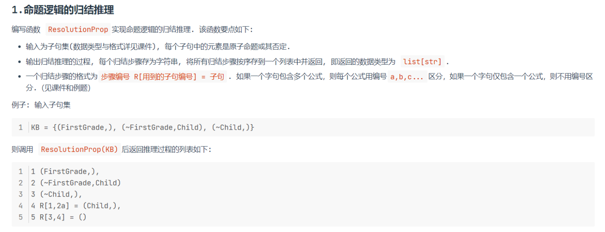
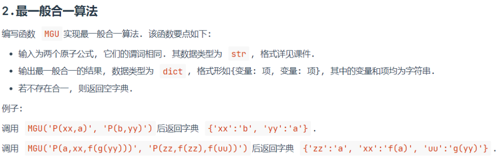
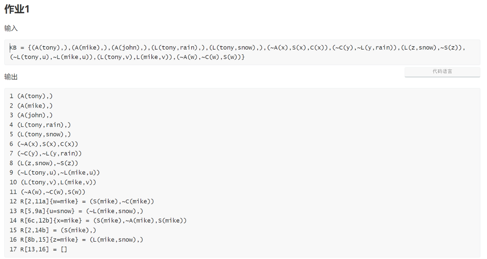
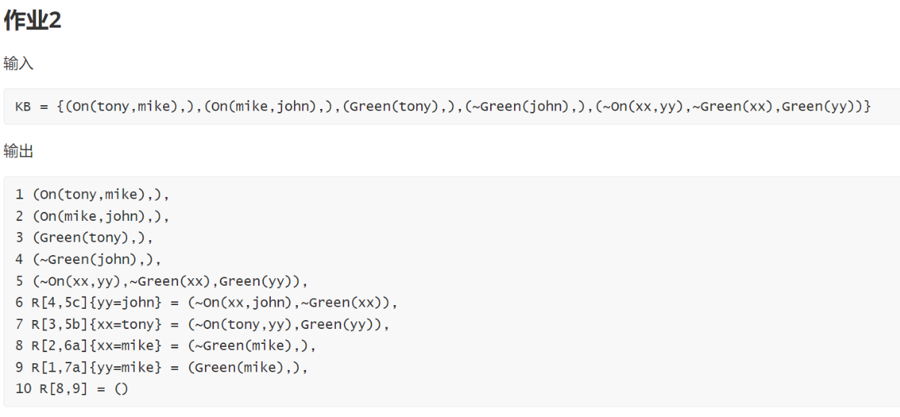

# Resolution

## 命题逻辑推理

相应代码文件：[propositional_logic_resolution.py](propositional_logic_resolution.py)

## 最一般合一算法

相应代码文件：[MGU.py](MGU.py)

## 一阶逻辑归结算法

相应代码文件：[predicate_logic_resolution.py](predicate_logic_resolution.py)